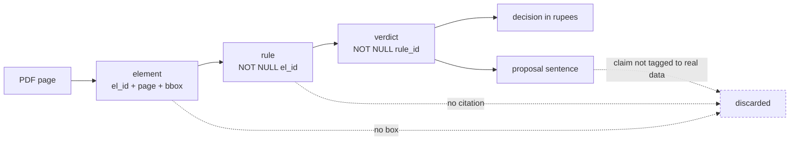
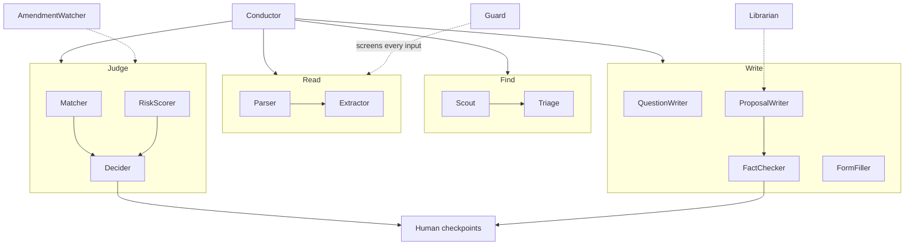
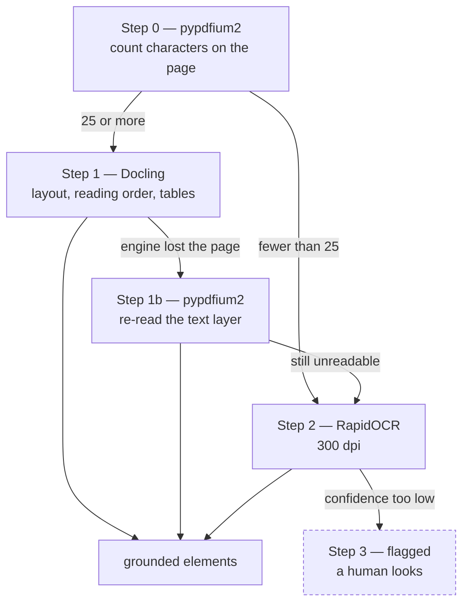
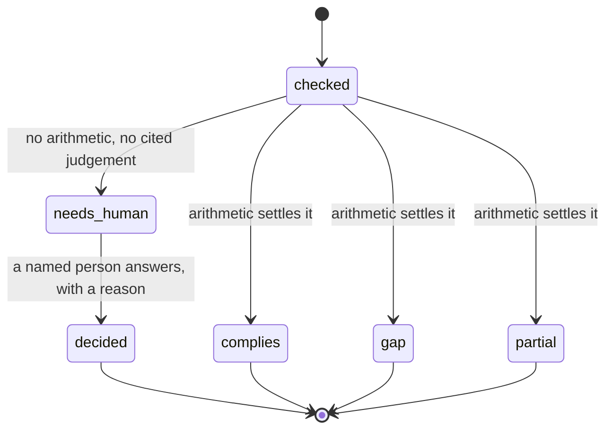
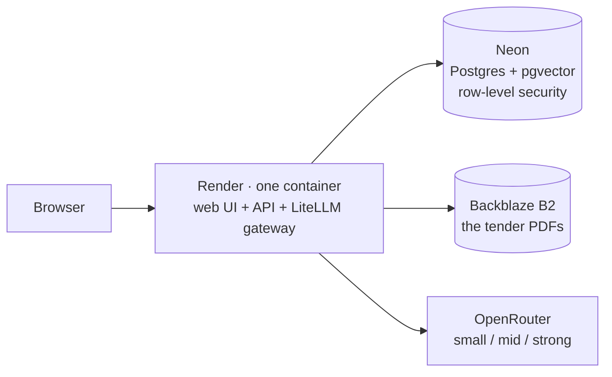
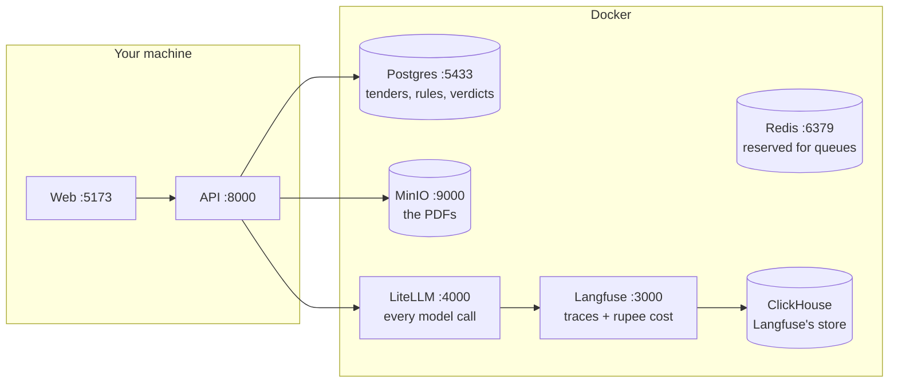

# BidProof

**Find government tenders, read them, decide whether to bid — in rupees — and draft the proposal. With proof for every claim.**

BidProof watches government tender portals, reads the documents (300–800 page PDFs, some scanned, some in Hindi), checks every rule against what your company actually has, tells you whether to bid **as a rupee figure**, and drafts the proposal. A human approves every important step.

Its one defining promise: **every fact, verdict and sentence clicks back to the exact page and box it came from.** The system is allowed to say *"I don't know."* It is never allowed to guess.

> **Live:** https://bidproof-wtjw.onrender.com — sign in as *Godrej Enterprises Group*, open any tender, click a `p.3` next to a rule.
> It runs on free tiers, so the first visit after a quiet spell takes about a minute to wake. [How it is hosted →](#hosting)


---

## Contents

1. [The problem](#the-problem)
2. [Try it in two minutes](#try-it-in-two-minutes)
3. [The proof chain](#the-proof-chain)
4. [What you get — the screens](#what-you-get--the-screens)
5. [Architecture](#architecture)
6. [The reader ladder](#the-reader-ladder)
7. [A verdict's life](#a-verdicts-life)
8. [How the proposal is written](#how-the-proposal-is-written)
9. [What the portals actually allow](#what-the-portals-actually-allow)
10. [Guardrails](#guardrails)
11. [Tech](#tech)
12. [Hosting](#hosting)
13. [Running it locally](#running-it-locally)
14. [Turning the models on](#turning-the-models-on)
15. [Developer tools](#developer-tools)
16. [Testing](#testing)
17. [Layout](#layout)
18. [Documentation](#documentation)
19. [Honest status](#honest-status)

---

## The problem

Companies that sell to the government drown in tenders. One tender can be an 800-page PDF — half scanned, price tables printed sideways, clauses in two languages. A sales engineer spends two days reading it. About **one bid in three is thrown out on paperwork** before the price envelope is even opened. And the largest loss is invisible: the tenders nobody ever saw.

BidProof turns those two days into minutes, and turns "we missed it" into a live list.

---

## Try it in two minutes

1. Open **https://bidproof-wtjw.onrender.com** and press **Sign in to your workspace** → *Godrej Enterprises Group*.
2. **Tender Radar** — two lists: tenders in your lane, and ones you could win but never bid on. Every card explains its own score.
3. Press **Open** on a tender → the **Rules** tab. Click the **`p.3`** beside any rule: the PDF opens on that page with the exact box highlighted. That is the proof chain, end to end.
4. **Matrix** → each rule against the company's real data, with a verdict and a confidence light. **Decision** → Go / No-Go as a rupee figure, the formula shown term by term. **Proposal** → a draft where every factual sentence carries a tag naming the record it came from.
5. **Agent Console** (left rail) — every step that ran, with tokens, latency and **rupee cost**.

The hosted copy has one deliberate limit: it runs without the OCR engines, so a *new* scanned upload is flagged for a human rather than read. Everything already loaded — including scanned tenders — was read by the full pipeline.

---

## The proof chain

This is the part that matters. Nothing enters the system without a page and a box, and the chain is enforced by foreign keys in the database — not by convention, and not by a prompt asking nicely.



An output that cannot point at its source is **thrown away, not down-scored**. The same mechanism is the defence against a poisoned document: instructions hidden in a tender PDF have nowhere to go, because a model's output is only accepted if it cites an element that genuinely exists.

---

## What you get — the screens

| Screen | What it does |
|---|---|
| **Landing & onboarding** | Add a company from two CSVs (facts, product catalogue); the checker can say *needs human* for anything left blank. |
| **Tender Radar** | Two lists — tenders in your lane, and tenders you could win but never bid on. Every card explains its own score. Upload a PDF or scrape a portal. |
| **Workspace** | One tender, every stage as a tab: Review · Rules · Matrix · Decision · Console · Amendments · Questions · Proposal · Checklist · Ask BidProof. |
| **Compliance Matrix** | Every rule vs your position: verdict, confidence light, click-to-proof. Exports to Excel. |
| **Decision Room** | Go / No-Go as a **rupee expected value**, the formula shown term by term, signed off by a named human. |
| **Amendment Alerts** | When the buyer changes the tender: what changed, which rules broke, and how the EV moved. |
| **Pre-bid Questions** | For every rule you fail, a drafted letter asking the buyer to relax it, citing clause and page. |
| **Proposal Studio** | A full draft in the sponsor's section order, every factual sentence tagged to a real record and fact-checked; resolve contradictions, approve sections in bulk. |
| **Agent Console** | Every step, live: which agent, which model role, tokens, latency, **rupee cost**, and where the run paused for a human. |
| **Model Lab · Analytics · Evaluation · Admin** | Per-role model comparison (simulated until real runs are wired), pipeline analytics, the gold-set scorecard, and model health / prompt approvals. |

---

## Architecture

A team of small, single-job agents behind one orchestrator. Each has its own guardrails, its own tests, and a [one-page manifest](agents/README.md). They talk only through typed state — never free text.

The **Conductor** is a LangGraph state graph ([`apps/api/app/conductor`](apps/api/app/conductor)). Agents that do not depend on each other run in the same superstep — the Matcher and the RiskScorer are drawn side by side below because that is how they execute, and [`tests/test_conductor.py`](tests/test_conductor.py) reads the compiled graph to keep this picture honest. The graph stops at every human checkpoint: checkpoints 4–6 are `interrupt()` nodes with a single edge to the end of the run, so there is no branch that could auto-pass one.



Every model call goes through **one gateway with three roles — small / mid / strong** — chosen by config ([`infra/litellm/config.yaml`](infra/litellm/config.yaml)). Swapping a model is an environment change, never a code change; no vendor or model name exists in application code, and [a test](tests/test_structure.py) fails the build if one appears.

---

## The reader ladder

Cheapest step first, and it degrades honestly at every rung. A page that cannot be read is **flagged for a human**, never invented.



Step 1b exists because of a real failure: on a 283-page tender Docling hit `std::bad_alloc`, silently returned pages with no content, and those pages went to OCR at ~45 s each to re-read text that was already in the file. Trying the built-in reader first cut a 6-page sample from **198 s to 33 s**. The ladder lives in [`agents/parser`](agents/parser).

---

## A verdict's life

The system is allowed to abstain — and when it does, there is somewhere for the human to answer.



`needs_human` blocks submission until someone answers. When they do, the machine's original verdict is kept alongside the human one, so an override is always visible and never passes as a machine judgement.

Arithmetic is **never** done by a model. Turnover comparisons, delivery-day maths, EMD and expected value are plain, testable code ([`agents/matcher`](agents/matcher), [`agents/decider`](agents/decider)). Models handle language; code handles numbers.

---

## How the proposal is written

The quality bar is a real winning proposal, kept in the repo as [`docs/REFERENCE_PROPOSAL.md`](docs/REFERENCE_PROPOSAL.md). The [ProposalWriter](agents/proposalwriter) follows its section order and six rules distilled from it — and the rules are enforced by code, not hoped for:

- **Every factual sentence carries a source tag** naming the record it came from — `[SRC: company_facts/turnover/FY2024-25]`, `[SRC: product_catalogue/…]` — and the [FactChecker](agents/factchecker) rejects a sentence whose tag points at nothing.
- **Nothing is invented to fill a gap.** A required figure that is not in the company's data appears as `[TO BE CONFIRMED: <field> — not in capability DB]`, which survives every check and is listed for a human to fill.
- **Numbers are quoted, never computed** by the model; derived figures come from code and are tagged `[SRC: derived/…]`.
- **Each clause gets its evidence** — the writer looks up the product record that answers a technical requirement rather than describing the catalogue in general.
- Contradictions between sections are surfaced as claims you resolve in the Proposal Studio; sections are approved by name, in bulk if you choose.
- Prompts are versioned and gated: a changed prompt must pass the gold set before [`infra/prompt_approvals.json`](infra/prompt_approvals.json) lets it ship.

---

## What the portals actually allow

Honest, because it shapes what the product can promise. Verified live on 2026-07-26.

| | GeM | CPPP (eprocure.gov.in) |
|---|---|---|
| Tender listing | ✅ scraped | ✅ scraped |
| Stable link to a tender | ✅ | ❌ links embed a session hash + timestamp and stop resolving |
| Tender detail readable | ✅ | ❌ **captcha-gated** |
| Document downloadable | ✅ `application/pdf`, no session or captcha | ❌ POST form behind a captcha |
| So BidProof can… | fetch and read the PDF automatically | show the listing, and hand you the reference to look up |

A captcha is a deliberate "no automation" sign, and BidProof respects it — there is no bypass. For CPPP the UI says so plainly and offers the tender reference with a copy button, rather than a link it knows is dead. Portal connectors are isolated in [`adapters/`](adapters) so one site breaking cannot break the rest.

---

## Guardrails

| Rule | How it is enforced |
|---|---|
| Nothing exists without a page and a box | foreign keys; uncited output is discarded |
| Document text is data, never instructions | every input fenced in labelled blocks and screened by the [Guard](agents/guard) agent |
| No agent can export, email, submit or delete | those endpoints are human-only, and audited |
| The Scout can only reach an allow-list of portals | plus IP-literal hosts and non-http schemes blocked outright (SSRF) |
| Models never do arithmetic | every number is plain code with its own tests |
| Prompts are versioned like code | a prompt change must pass the gold set in CI |
| Tenants are isolated | PostgreSQL row-level security, forced on every table — even the owner role sees nothing without an org context |
| The audit log is append-only | every human decision recorded with a name, a reason, a timestamp |
| The attack suite must stay green | [`tests/test_attack_suite.py`](tests/test_attack_suite.py): poisoned documents that must never change a verdict |

---

## Tech

| Layer | Choice |
|---|---|
| Backend | FastAPI, async SQLAlchemy, PostgreSQL + pgvector, Alembic |
| Orchestration | LangGraph (the Conductor); each agent a typed Python package |
| Models | LiteLLM gateway with roles small / mid / strong; any OpenAI-compatible provider; Langfuse tracing (optional) |
| PDF / ML | pypdfium2 → Docling → RapidOCR ladder |
| Object store | any S3-compatible store — MinIO locally, Backblaze B2 hosted |
| Frontend | React 19 + TypeScript + Tailwind + Vite; pdf.js for click-to-proof |
| Infra | Docker Compose locally; one container image for hosting |

Licences are restricted to MIT / Apache in the core, and a licence scan runs in [CI](.github/workflows/ci.yml).

---

## Hosting

The live copy costs nothing to run. One container holds the API, the model gateway and the built web UI; the database and the PDFs are managed services on permanent free tiers.



- [`Dockerfile`](Dockerfile) — the whole product in one image. Built with `WITH_ML=1` it carries Docling and the OCR models (≈5.5 GB, needs 2–4 GB RAM); with `WITH_ML=0` it is a 1.6 GB image that fits a 512 MB instance and flags scanned pages for a human.
- [`infra/deploy/README.md`](infra/deploy/README.md) — the step-by-step guide: three sign-ups, one file of inputs, two commands. It also covers the full-strength path (an Ubuntu VM behind Caddy with HTTPS and a site login), which the same tooling deploys unchanged.
- Redeploying is a push to `main`; Render rebuilds in about four minutes.

---

## Running it locally

**You need:** Docker Desktop, Python 3.12, Node 20+, and [uv](https://github.com/astral-sh/uv).

### From VS Code

`Ctrl+Shift+P` → **Run Task** → **BidProof: DEMO — start everything.** That brings up the containers, then the API and the web app side by side. Open **http://localhost:5173**.

Other tasks: *Inspect a PDF*, *Company data*, *Company gaps*, *Tests*. `F5` starts the API with breakpoints.

### From a terminal

```bash
cp .env.example .env
docker compose -f infra/docker-compose.yml --env-file .env up -d

uv sync --project apps/api --extra ml --extra scrapers
uv run --project apps/api alembic -c apps/api/alembic.ini upgrade head
uv run --project apps/api python -m uvicorn app.main:app --reload --port 8000

npm --prefix apps/web install && npm --prefix apps/web run dev
```

The two extras are what make scanned pages readable (`ml`) and GeM scrapable (`scrapers`); a plain `uv sync` prunes them. The API serves an interactive view of every endpoint at **http://localhost:8000/docs**.

### What Docker is running

Seven containers, none of which hold your application code — that runs from your editor.



Your data lives in Docker **volumes**, so `docker compose down` stops the containers without losing anything.

### Demo data

```bash
uv run --project apps/api python infra/seed/seed_demo.py
uv run --project apps/api python infra/seed/seed_reference_proposal.py
```

Both are idempotent. The first seeds the organisation, capability database, product catalogue and two tenders pushed through the real pipeline; the second loads the reference proposal as the writer's retrieval seed.

| Tender | What it shows |
|---|---|
| `tender_winnable.pdf` | the happy path — rules extracted, matrix mostly complying, a Go decision in rupees |
| `tender_hard.pdf` | the **failing** path — ₹500 crore turnover, ISO 45001, a 15-day delivery the company cannot meet, so real `gap` verdicts appear, the risk register fills, and pre-bid query letters get drafted |

Both are needed: with no gaps, the QuestionWriter has nothing to draft and half the demo stays invisible.

For the Godrej pilot, `infra/seed/seed_godrej_public.py` loads their real **public** data — group turnover, ISO 9001/14001/45001 + GreenPro, and the named racking systems with published load ratings and EN 15512 / FEM / RMI compliance. Every figure carries the page it came from. It deliberately leaves certificate expiry dates, lead times, capacity and past contract values empty, because those are not public — so the checker returns `needs_human` rather than a number nobody can defend.

---

## Turning the models on

Out of the box BidProof runs **fully deterministic** — pattern matching, plain-code arithmetic and templates — so the whole pipeline demos with no keys and no cost. Add three roles to `.env` to switch real models on:

```env
LLM_SMALL_MODEL=openai/qwen/qwen3-30b-a3b
LLM_SMALL_API_BASE=https://openrouter.ai/api/v1
LLM_SMALL_API_KEY=...
# same shape for LLM_MID_* and LLM_STRONG_*
```

The app probes all three roles at startup and says so loudly if any is unreachable — a template answer dressed as a model answer is exactly how a shallow output reaches a customer, so degraded mode is never silent. `/health/models` surfaces it in the UI as the *Live models* / *Deterministic* badge.

---

## Developer tools

Two read-only tools, safe to run mid-demo:

```bash
# what did the reader actually do to this file?
uv run --project apps/api python tools/inspect_pdf.py "tender.pdf" --pages 1-5 --text

# what do we know about this company, and what is missing?
uv run --project apps/api python tools/show_company.py --company godrej --gaps
```

`inspect_pdf` runs the same ladder the API uses, and prints the step-0 routing decision, per-page result and sample text **with bounding boxes**. `show_company` prints every fact with its source line, then a GAPS section — because when a verdict says *needs human*, the cause is almost always a missing field rather than a fault.

---

## Testing

```bash
uv run --project apps/api python -m pytest -m "not integration" -q   # 279 tests, no Docker needed
uv run --project apps/api python -m pytest -q                        # 395 tests, needs the stack
npm --prefix apps/web run test                                       # 105 tests
```

> **The full suite wipes the database it is pointed at.** The integration fixtures
> TRUNCATE `organizations` and `tenders` on purpose. They now refuse to run against a
> database that already holds data unless `BIDPROOF_TEST_DB_TRUNCATE_OK=1` is set — CI
> sets it; on a machine with a live demo, point `DATABASE_URL_OWNER` at a throwaway
> database instead. The fast suite touches no database.

Beyond unit tests there is a labelled **gold set** ([`tests/gold`](tests/gold)) for measuring extraction accuracy, and an **attack suite** of poisoned documents that must never change a verdict. The pre-commit hook runs the fast suite; CI runs everything plus the licence scan.

---

## Layout

```
apps/api        API service and the Conductor       21 routers, 22 migrations
apps/web        React app                           the screens, one AppShell
agents/         one folder per agent                15 agents, each with a manifest
adapters/       isolated portal connectors          one site breaking cannot break the rest
infra/          Docker Compose, gateway config, seed data, deploy tooling
tools/          read-only inspection scripts
tests/          test suite + gold set + attack suite
docs/           the specification — the source of truth
```

---

## Documentation

| Document | What it is for |
|---|---|
| [`docs/SPEC.md`](docs/SPEC.md) | The single source of truth: user stories, agents, checkpoints, guardrails, the screens. |
| [`docs/BUILD_PLAYBOOK.md`](docs/BUILD_PLAYBOOK.md) | How the work is run: one story at a time, tests first, the prompt pattern for each story. |
| [`docs/REFERENCE_PROPOSAL.md`](docs/REFERENCE_PROPOSAL.md) | The winning proposal the writer is measured against. |
| [`docs/DEMO_READINESS.md`](docs/DEMO_READINESS.md) | What to click in a demo and what to say about each screen. |
| [`docs/FINISH_STATUS.md`](docs/FINISH_STATUS.md) | Story-by-story status against the spec. |
| [`agents/README.md`](agents/README.md) and each agent's `MANIFEST.md` | One page per agent: its single job, inputs, outputs, model role, tools, guardrails, tests. |
| [`infra/deploy/README.md`](infra/deploy/README.md) | Hosting for free, step by step, and the tooling that does it. |
| [`parking-lot.md`](parking-lot.md) | Ideas that were deliberately not built yet, with the reason each is parked. |

---

## Honest status

Working end to end, locally and on the hosted copy: upload or discover a tender, parse it into grounded clickable elements, get a compliance matrix with click-to-proof and Excel export, a Go/No-Go in rupees with the maths shown and signed off, corrigendum diffs with the EV movement, drafted pre-bid letters, a proposal with every sentence tagged to a real record and fact-checked, and a live cost console.

Known weak spots, stated rather than hidden:

- **CPPP documents cannot be fetched** — captcha, described above. GeM documents can.
- **The hosted copy has no OCR** — the free tier has 512 MB; scanned uploads are flagged for a human. The full image is built and tested and runs on any VM with 4 GB.
- **No login yet** on the hosted copy; the URL is unlisted rather than protected. The VM deploy adds a site login; real accounts are a planned story (US-16).
- **Confidence is not yet calibrated.** The UI shows `Not calibrated yet` instead of inventing a curve.
- **The Model Lab is a simulator** until real per-role runs are wired; every row says so.
- **Conductor checkpoints 5 and 6** (proposal sections, submission) still run through the service layer; checkpoint 4 pauses the graph.
- **Proposal depth** depends heavily on how much real company data has been loaded, and the evidence matcher is keyword overlap, not embeddings.

---

*Design partner and first customer: Godrej Enterprises Group.*
