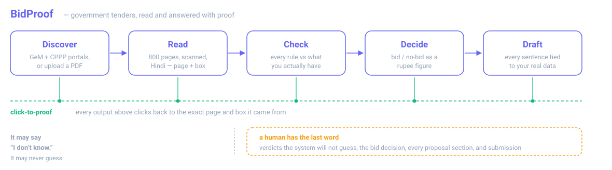
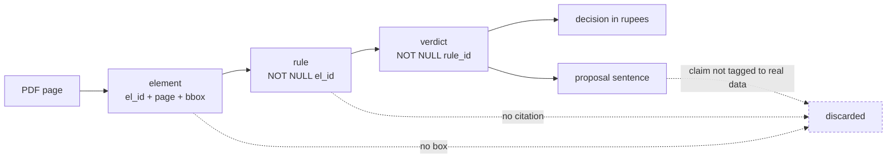
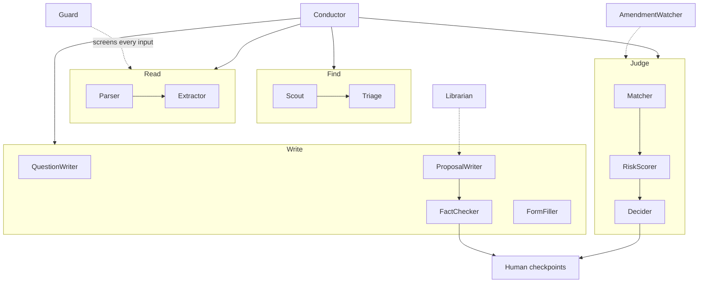
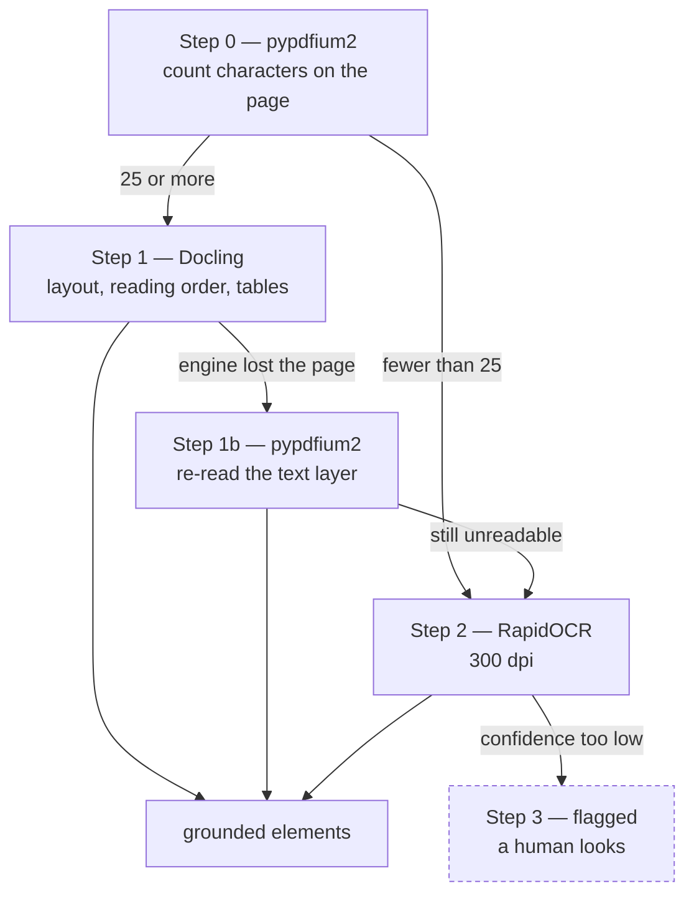
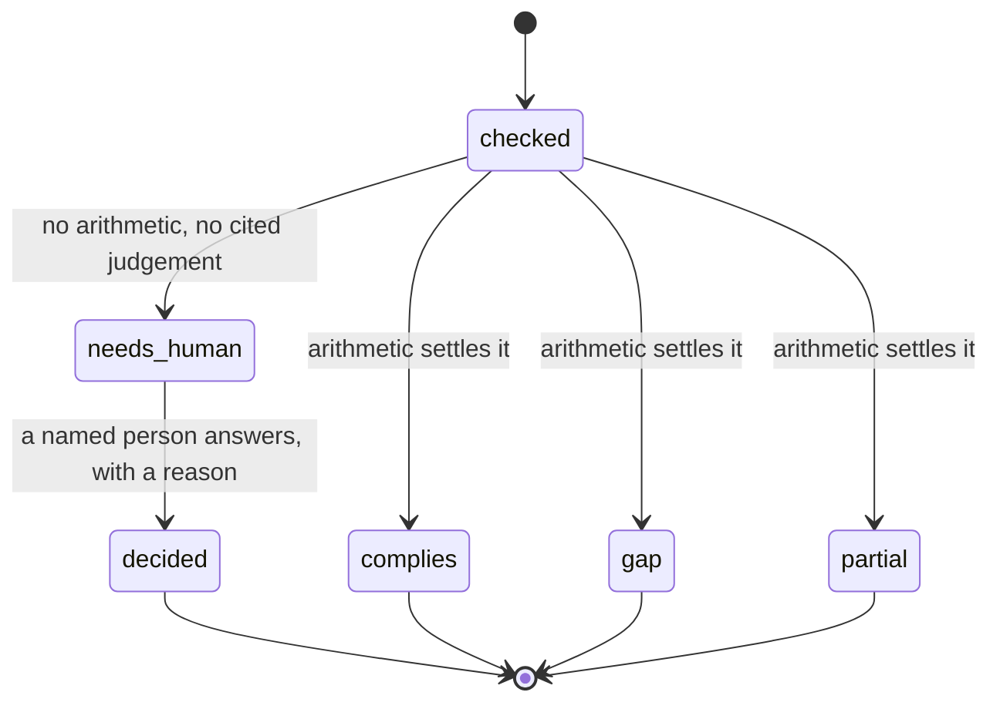
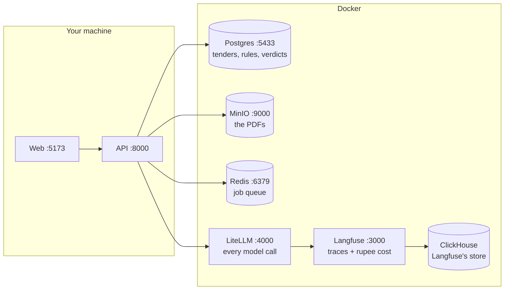

# BidProof

**Find government tenders, read them, decide whether to bid — in rupees — and draft the proposal. With proof for every claim.**

BidProof watches government tender portals, reads the documents (300–800 page PDFs, some scanned, some in Hindi), checks every rule against what your company actually has, tells you whether to bid **as a rupee figure**, and drafts the proposal. A human approves every important step.

Its one defining promise: **every fact, verdict and sentence clicks back to the exact page and box it came from.** The system is allowed to say *"I don't know."* It is never allowed to guess.



---

## The problem

Companies that sell to the government drown in tenders. One tender can be an 800-page PDF — half scanned, price tables printed sideways, clauses in two languages. A sales engineer spends two days reading it. About **one bid in three is thrown out on paperwork** before the price envelope is even opened. And the largest loss is invisible: the tenders nobody ever saw.

BidProof turns those two days into minutes, and turns "we missed it" into a live list.

---

## The proof chain

This is the part that matters. Nothing enters the system without a page and a box, and the chain is enforced by foreign keys in the database — not by convention, and not by a prompt asking nicely.



An output that cannot point at its source is **thrown away, not down-scored**. The same mechanism is the defence against a poisoned document: instructions hidden in a tender PDF have nowhere to go, because a model's output is only accepted if it cites an element that genuinely exists.

---

## What you get

| Screen | What it does |
|---|---|
| **Tender Radar** | Two lists — tenders in your lane, and tenders you could win but never bid on. Every card explains its own score. |
| **Compliance Matrix** | Every rule vs your position: verdict, confidence light, click-to-proof. Exports to Excel. |
| **Decision Room** | Go / No-Go as a **rupee expected value**, the formula shown term by term, signed off by a named human. |
| **Amendment Alerts** | When the buyer changes the tender: what changed, which rules broke, and how the EV moved. |
| **Pre-bid Questions** | For every rule you fail, a drafted letter asking the buyer to relax it, citing clause and page. |
| **Proposal Studio** | A full draft where every factual sentence is tagged to your real data and fact-checked. |
| **Agent Console** | Every step, live: tokens, latency, **rupee cost**. |

---

## Architecture

A team of small, single-job agents behind one orchestrator. Each has its own guardrails, its own tests, and a one-page manifest. They talk only through typed state — never free text.



Every model call goes through **one gateway with three roles — small / mid / strong** — chosen by config. Swapping a model is an environment change, never a code change. Which model wins each role is decided by measuring on labelled data in the Model Lab, not by guesswork.

---

## The reader ladder

Cheapest step first, and it degrades honestly at every rung. A page that cannot be read is **flagged for a human**, never invented.



Step 1b exists because of a real failure: on a 283-page tender Docling hit `std::bad_alloc`, silently returned pages with no content, and those pages went to OCR at ~45 s each to re-read text that was already in the file. Trying the built-in reader first cut a 6-page sample from **198 s to 33 s**.

---

## A verdict's life

The system is allowed to abstain — and when it does, there is somewhere for the human to answer.



`needs_human` blocks submission until someone answers. When they do, the machine's original verdict is kept alongside the human one, so an override is always visible and never passes as a machine judgement.

Arithmetic is **never** done by a model. Turnover comparisons, delivery-day maths, EMD and expected value are plain, testable code. Models handle language; code handles numbers.

---

## What the portals actually allow

Honest, because it shapes what the product can promise. Verified live on 2026-07-26.

| | GeM | CPPP (eprocure.gov.in) |
|---|---|---|
| Tender listing | ✅ scraped | ✅ scraped |
| Stable link to a tender | ✅ | ❌ links embed a session hash + timestamp and stop resolving |
| Tender detail readable | ✅ | ❌ **captcha-gated** |
| Document downloadable | ✅ `application/pdf`, no session or captcha | ❌ POST form behind a captcha |
| So BidProof can… | fetch and read the PDF automatically | show the listing, and hand you the reference to look up |

A captcha is a deliberate "no automation" sign, and BidProof respects it — there is no bypass. For CPPP the UI says so plainly and offers the tender reference with a copy button, rather than a link it knows is dead.

---

## Guardrails

| Rule | How it is enforced |
|---|---|
| Nothing exists without a page and a box | foreign keys; uncited output is discarded |
| Document text is data, never instructions | every input fenced in labelled blocks and screened by the Guard agent |
| No agent can export, email, submit or delete | those endpoints are human-only, and audited |
| The Scout can only reach an allow-list of portals | plus IP-literal hosts and non-http schemes blocked outright (SSRF) |
| Models never do arithmetic | every number is plain code with its own tests |
| Prompts are versioned like code | a prompt change must pass the gold set in CI |
| Tenants are isolated | PostgreSQL row-level security, forced on every table |
| The audit log is append-only | every human decision recorded with a name, a reason, a timestamp |

---

## Tech

| Layer | Choice |
|---|---|
| Backend | FastAPI, PostgreSQL + pgvector, MinIO, Redis |
| Agents | one typed Python package each; LiteLLM gateway; Langfuse tracing |
| PDF / ML | pypdfium2 + Docling + RapidOCR; BGE-M3 retrieval |
| Frontend | React + TypeScript + Tailwind, pdf.js for click-to-proof |
| Infra | Docker Compose |

Licences are restricted to MIT / Apache in the core, and a licence scan runs in CI.

---

## Running it

**You need:** Docker Desktop, Python 3.12, Node 20+, and [uv](https://github.com/astral-sh/uv).

### From VS Code

`Ctrl+Shift+P` → **Run Task** → **BidProof: DEMO — start everything.** That brings up the containers, then the API and the web app side by side. Open **http://localhost:5173**.

Other tasks: *Inspect a PDF*, *Company data*, *Company gaps*, *Tests*. `F5` starts the API with breakpoints.

### From a terminal

```bash
cp .env.example .env
docker compose -f infra/docker-compose.yml --env-file .env up -d

uv sync --project apps/api
uv run --project apps/api alembic -c apps/api/alembic.ini upgrade head
uv run --project apps/api uvicorn app.main:app --reload --port 8000

npm --prefix apps/web install && npm --prefix apps/web run dev
```

The API serves an interactive view of every endpoint at **http://localhost:8000/docs**.

### What Docker is running

Seven containers, none of which hold your application code — that runs from your editor.



Your data lives in Docker **volumes**, so `docker compose down` stops the containers without losing anything.

### Demo data

```bash
uv run --project apps/api python infra/seed/seed_demo.py
```

Idempotent — run it any time, including after an integration-test run (the fixtures truncate the database on purpose). It seeds the organisation, capability database, product catalogue, past-proposal library, and two tenders pushed through the real pipeline:

| Tender | What it shows |
|---|---|
| `tender_winnable.pdf` | the happy path — rules extracted, matrix mostly complying, a Go decision in rupees |
| `tender_hard.pdf` | the **failing** path — ₹500 crore turnover, ISO 45001, a 15-day delivery the company cannot meet, so real `gap` verdicts appear, the risk register fills, and pre-bid query letters get drafted |

Both are needed: with no gaps, the QuestionWriter has nothing to draft and half the demo stays invisible.

For the Godrej pilot, `seed_godrej_public.py` loads their real **public** data — group turnover, ISO 9001/14001/45001 + GreenPro, and the named racking systems with published load ratings and EN 15512 / FEM / RMI compliance. Every figure carries the page it came from. It deliberately leaves certificate expiry dates, lead times, capacity and past contract values empty, because those are not public — so the checker returns `needs_human` rather than a number nobody can defend.

---

## Turning the models on

Out of the box BidProof runs **fully deterministic** — pattern matching, plain-code arithmetic and templates — so the whole pipeline demos with no keys and no cost. Add three roles to `.env` to switch real models on:

```env
LLM_SMALL_MODEL=openai/qwen/qwen3-30b-a3b
LLM_SMALL_API_BASE=https://openrouter.ai/api/v1
LLM_SMALL_API_KEY=...
# same shape for LLM_MID_* and LLM_STRONG_*
```

The app probes all three roles at startup and says so loudly if any is unreachable — a template answer dressed as a model answer is exactly how a shallow output reaches a customer, so degraded mode is never silent. `/health/models` surfaces it in the UI.

---

## Developer tools

Two read-only tools, safe to run mid-demo:

```bash
# what did the reader actually do to this file?
uv run --project apps/api python tools/inspect_pdf.py "tender.pdf" --pages 1-5 --text

# what do we know about this company, and what is missing?
uv run --project apps/api python tools/show_company.py --company godrej --gaps
```

`inspect_pdf` runs the same ladder the API uses, and prints the step-0 routing decision, per-page result and sample text **with bounding boxes**. `show_company` prints every fact with its source line, then a GAPS section — because when a verdict says *needs human*, the cause is almost always a missing field rather than a fault.

---

## Testing

```bash
uv run --project apps/api pytest -m "not integration" -q   # 179, no Docker needed
uv run --project apps/api pytest -q                        # 292, needs the stack
npm --prefix apps/web run test                             # 87
```

Beyond unit tests there is a labelled **gold set** for measuring extraction accuracy, and an **attack suite** of poisoned documents that must never change a verdict.

---

## Layout

```
apps/api        API service and orchestration       20 routers, 21 migrations
apps/web        React app                           the 10 screens
agents/         one folder per agent                15 agents, each with a manifest
adapters/       isolated portal connectors          one site breaking cannot break the rest
infra/          Docker Compose, seed data
tools/          read-only inspection scripts
tests/          test suite + gold set + attack suite
docs/           the specification — the source of truth
```

---

## Honest status

Working end to end: upload or discover a tender, parse it into grounded clickable elements, get a compliance matrix with click-to-proof and Excel export, a Go/No-Go in rupees with the maths shown and signed off, corrigendum diffs with the EV movement, drafted pre-bid letters, a fact-checked proposal, and a live cost console.

Known weak spots, stated rather than hidden:

- **CPPP documents cannot be fetched** — captcha, described above. GeM documents can.
- **Confidence is not yet calibrated.** The UI shows `Not calibrated yet` instead of inventing a curve.
- **Proposal depth** depends heavily on how much real company data has been loaded.
- **Retrieval quality** has not been measured against a large past-bid library.

---

*Design partner and first customer: Godrej Enterprises Group.*
